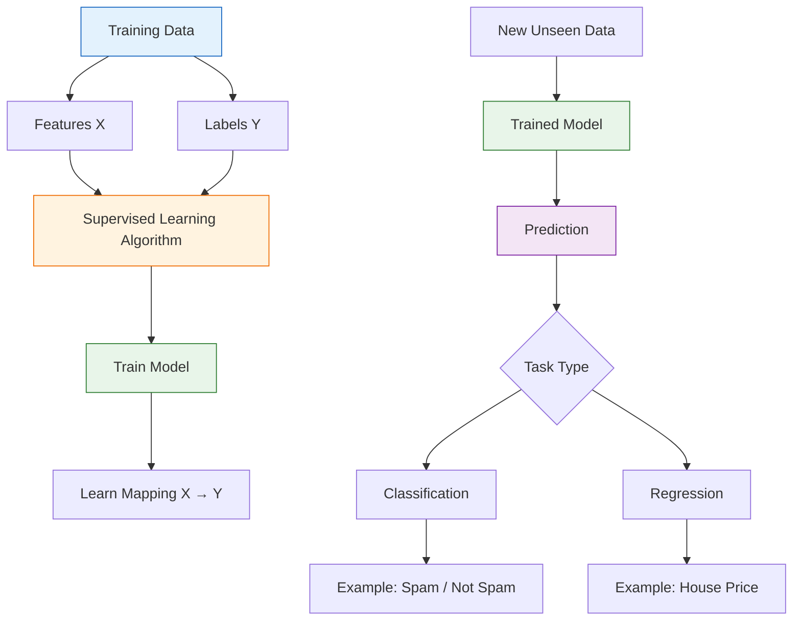

# Supervised Learning

#### Supervised Learning

Supervised learning is a type of **machine learning** where a model learns from **labeled data**. Each training example contains an input (features) and its correct output (label). The model learns the relationship between them and uses it to make predictions on new, unseen data.

There are two main types of supervised learning:

* **Classification:** Predicts categories or classes, such as spam/not spam or pass/fail.
* **Regression:** Predicts continuous numerical values, such as house prices or temperature.

**Examples:** Linear Regression, Logistic Regression, Decision Trees, Support Vector Machines (SVM), and Neural Networks.

**In simple words:** Supervised learning means **learning from examples with known answers**.

