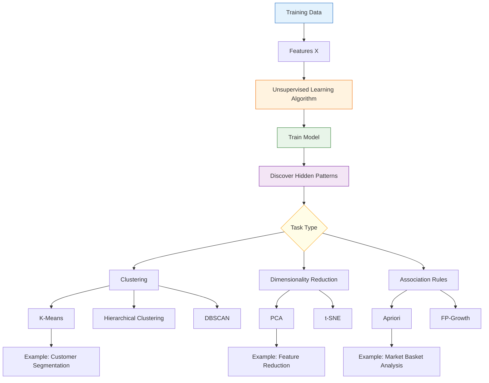

# Unsupervised Learning

#### Unsupervised Learning

Unsupervised learning is a type of **machine learning** where a model learns patterns or structures from **unlabeled data** without being given the correct answers.

**Main techniques:**

* **Clustering:** Groups similar data points together, e.g., customer segmentation.
* **Association:** Finds relationships between items, e.g., products frequently bought together.
* **Dimensionality reduction:** Reduces the number of features while preserving important information, e.g., PCA.

**Example:** A system analyzes customer data and automatically divides customers into different groups based on their purchasing behavior.

**In short:** Unsupervised learning discovers hidden patterns and relationships in data without labeled outputs.

